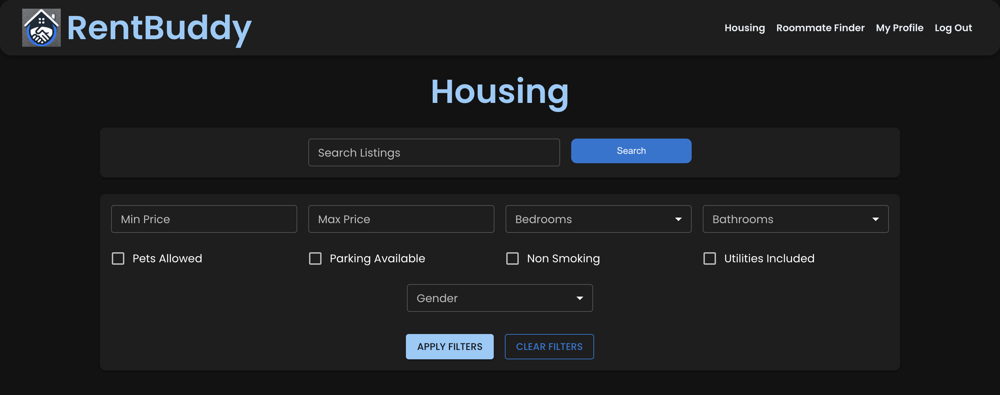
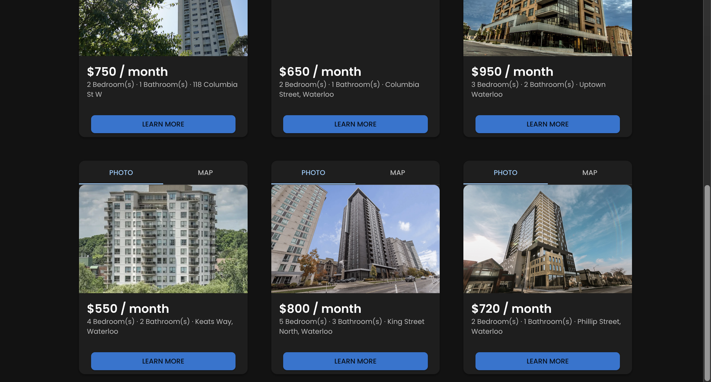
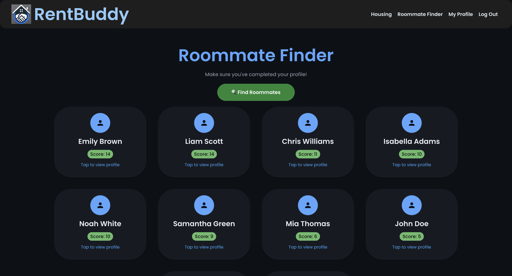
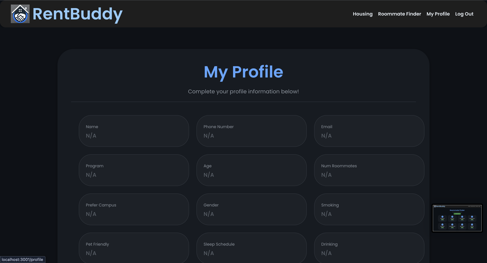
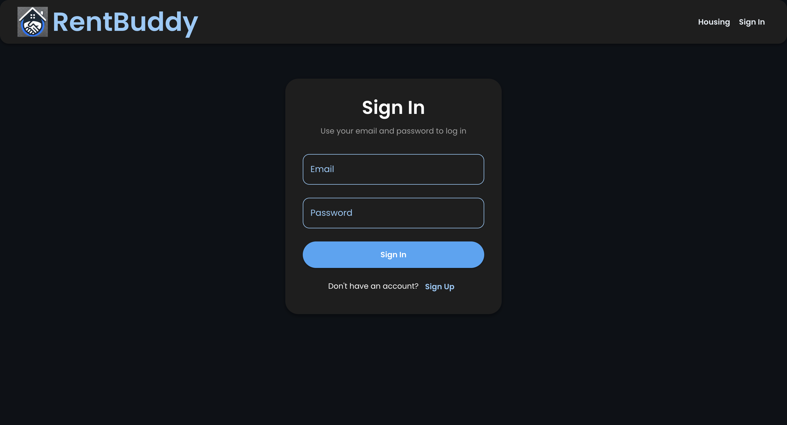

[

# RentBuddy

RentBuddy is a full-stack web application designed to help university students find housing and compatible roommates. The platform allows users to browse housing listings, filter properties based on preferences, and discover potential roommates using a compatibility scoring algorithm.

This project was developed in a **team of four students** using an **Agile/Scrum development process**, where features were delivered iteratively through multiple development sprints.

---

## Features

### Housing Search
Users can browse available housing listings scraped from online sources and stored in a database.

Key capabilities include:
- Keyword search
- Price range filtering
- Bedroom and bathroom filters
- Lifestyle filters (pets allowed, utilities included, parking available, non-smoking)

Each listing displays:
- Price per month
- Address
- Number of bedrooms and bathrooms
- Property images
- Interactive map location

---

### Roommate Finder

RentBuddy includes a roommate matching system that helps students find compatible living partners.

The matching system analyzes:
- Lifestyle preferences
- Housing preferences
- Personal profile information

Users receive a **compatibility score** that helps them identify potential roommates with similar living habits and preferences.

---

### User Authentication

The platform includes a secure authentication system that allows users to:

- Create an account
- Log in securely
- Access personalized features

Once authenticated, users gain access to additional features such as:
- Roommate matching
- Profile management
- Personalized housing recommendations

Authentication is handled using **Firebase Authentication**.

---

### User Profiles

Users can create and manage personal profiles containing information used for roommate matching.

Profile data includes:

- Name
- Age
- Program of study
- Preferred campus
- Gender
- Smoking preference
- Pet preference
- Sleep schedule
- Drinking habits
- Preferred number of roommates

This data feeds into the roommate compatibility algorithm.

---

### Reviews System

Students can leave reviews and ratings on housing listings based on their experience.

This feature allows future renters to:
- Evaluate properties
- Read student feedback
- Make better housing decisions

---

## Tech Stack

### Frontend
- React
- JavaScript
- HTML
- CSS

### Backend
- Node.js
- Express.js

### Database
- MySQL

### Authentication
- Firebase Authentication

### Other
- Web scraping for housing listings
- REST API communication between frontend and backend

---

## Application Architecture

The application follows a full-stack architecture:
React Frontend
↓
Node.js / Express API
↓
MySQL Database

- The frontend sends API requests to the backend.
- The backend processes requests and queries the database.
- Data is returned dynamically and rendered in the user interface.

---

## Screenshots

### Housing Search

### Listing Results

### Roommate Finder

### User Profile

### Authentication

---

## Agile Development Process

The project was developed using a **Scrum-based Agile workflow**.

The team worked in multiple development sprints, where each sprint focused on delivering incremental functionality.

### Sprint 1
- Built the initial UI framework
- Scraped housing data from online sources
- Developed the first version of the roommate compatibility algorithm

### Sprint 2
- Implemented advanced housing filters
- Developed the user profile system
- Integrated Firebase authentication
- Connected frontend components to the MySQL database

### Sprint 3
- Added interactive maps for housing listings
- Implemented a review and rating system
- Improved UI design and responsiveness
- Finalized database integration and real-time data rendering

---

## Key Learning Outcomes

This project provided hands-on experience with:

- Building full-stack web applications
- Designing REST APIs
- Integrating frontend frameworks with backend services
- Working with relational databases
- Implementing authentication systems
- Developing compatibility algorithms
- Collaborating in Agile/Scrum development teams

---

## Future Improvements

Potential future improvements include:

- Improved roommate recommendation algorithm
- Messaging system between roommates
- Saved housing listings
- Google Maps integration for commute distance
- Mobile responsive enhancements
- Listing availability updates

---

## Team

This project was developed collaboratively by a team of four students as part of a university software development course.

---

## Author

Cristian Craciun  
Management Engineering Student  
University of Waterloo